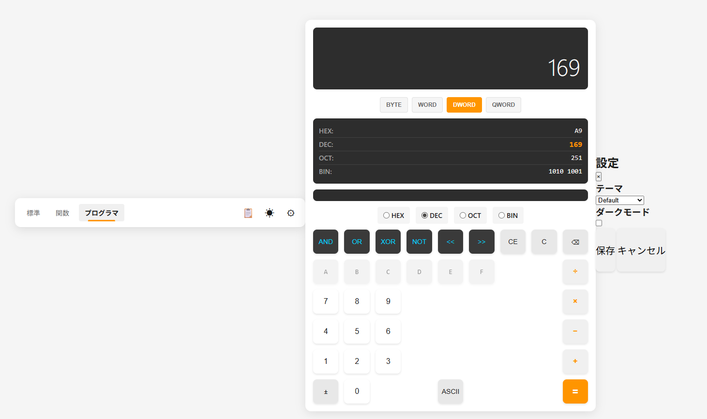

# Multi-Mode Calculator

複数の計算モードと10種類のカスタマイズ可能なデザインテーマを備えたWeb電卓アプリケーションです。

## プロジェクト概要

**Multi-Mode Calculator** は、HTML5、CSS3、JavaScriptを使用して開発された、多機能なWeb電卓です。標準的な四則演算から科学計算、プログラミング作業に必要な進数変換まで、様々な計算ニーズに対応しています。

### 特徴

- **3つの計算モード**: 標準、関数（科学）、プログラマ
- **10種類のデザインテーマ**: 好みに合わせてカスタマイズ可能
- **ライト/ダークモード**: 環境に応じた表示切り替え
- **計算履歴管理**: 最大100件の計算結果を保存・再利用
- **キーボード対応**: マウスとキーボード両方で操作可能
- **レスポンシブデザイン**: PC、タブレット、スマートフォンに対応
- **ライブラリ不要**: Vanilla JavaScriptで実装（依存関係なし）
- **オフライン対応**: インターネット接続不要

---

## スクリーンショット



*標準電卓モードの画面例*

---

## 主要機能

### 1. 標準電卓モード

基本的な計算機能を提供します。

- 四則演算（加算、減算、乗算、除算）
- パーセント計算
- 符号変更（±）
- 小数点入力

### 2. 関数電卓モード

高度な科学計算に対応しています。

- 三角関数（sin, cos, tan）
- 逆三角関数（asin, acos, atan）
- 対数関数（log10, ln）
- 累乗・べき乗（x², x³, xʸ）
- 平方根・立方根（√, ∛）
- 円周率（π）、自然対数の底（e）
- 階乗（n!）
- 度・ラジアン変換

### 3. プログラマ電卓モード

開発者向けの機能を備えています。

- **進数変換**: 2進数、8進数、10進数、16進数間の相互変換
- **ビット演算**: AND、OR、XOR、NOT、左シフト、右シフト
- **ASCII変換**: 数値とASCII文字の相互変換
- **ビット表示**: 2進表示と各ビット状態を可視化

### 4. 計算履歴機能

- 最大100件の計算履歴を自動保存
- 履歴項目をクリックして結果を再利用
- 履歴のクリア機能
- LocalStorageで永続化（ブラウザを閉じても保持）

### 5. テーマ・カスタマイズ

10種類の美しいテーマから選択可能です。

| テーマ | 説明 |
|--------|------|
| Default | シンプルなグレー基調 |
| Ocean | 爽やかな青・水色のグラデーション |
| Forest | 自然をイメージした緑系 |
| Sunset | 温かいオレンジ・赤のグラデーション |
| Midnight | 深い紺・紫の落ち着いた色合い |
| Cherry | ピンク・桜色のロマンチック系 |
| Monochrome | クラシックな白黒デザイン |
| Neon | サイバーパンク風の蛍光色 |
| Wooden | 木目調・ナチュラルデザイン |
| Glass | 透明感・ガラス風のモダン系 |

### 6. キーボード操作

マウスなしでキーボードのみで操作可能です。

- 数字キー（0-9）: 数値入力
- 演算子キー（+, -, *, /）: 演算入力
- Enter: 計算実行
- Backspace: 最後の入力削除
- Delete: 全入力クリア
- Escape: 計算キャンセル

---

## 技術スタック

| 種類 | 技術 |
|------|------|
| **マークアップ** | HTML5 |
| **スタイリング** | CSS3（カスタムプロパティ、CSS Grid、Flexbox） |
| **スクリプト言語** | JavaScript（ES6+） |
| **フレームワーク** | なし（Vanilla JS） |
| **ビルドツール** | なし |
| **テストフレームワーク** | Playwright |

### 動作環境

- **ブラウザ**: Chrome、Firefox、Safari、Edge（最新版）
- **デバイス**: PC、タブレット、スマートフォン
- **通信**: オフライン動作可能

---

## インストール・起動方法

### 前提条件

- Node.js 14以上（テスト実行時のみ必要）
- ブラウザ（Chrome、Firefox、Safari、Edge など）

### 1. リポジトリのクローン

```bash
git clone <repository-url>
cd Calculator
```

### 2. 依存パッケージのインストール（オプション）

テスト実行に必要な場合:

```bash
npm install
```

### 3. ローカルサーバーの起動

#### 方法A: Node.js（http-server）を使用

```bash
npx http-server src
```

サーバーが起動したら、ブラウザで `http://localhost:8080` を開きます。

#### 方法B: Pythonを使用

```bash
# Python 3
python -m http.server 8000 --directory src

# Python 2
python -m SimpleHTTPServer 8000
```

ブラウザで `http://localhost:8000` を開きます。

#### 方法C: Visual Studio CodeのLive Server拡張

1. VSCode で `src/index.html` を開く
2. 「Go Live」をクリック
3. ブラウザが自動的に開きます

#### 方法D: ファイルシステムから直接開く

`src/index.html` をブラウザにドラッグ&ドロップ、またはブラウザで開きます。

※ただし、一部の機能（LocalStorage永続化など）がブラウザのセキュリティ制限で正常に動作しない場合があるため、ローカルサーバーの使用を推奨します。

---

## 使い方

### 基本的な操作

#### 1. 計算の実行

1. **電卓モードを選択**:タブから計算モード（標準 / 関数 / プログラマ）を選択
2. **数値を入力**: マウスまたはキーボードで数値を入力
3. **演算子を選択**: 実行したい演算（+, -, ×, ÷など）を選択
4. **計算実行**: 「=」ボタンを押すか、Enterキーを押す
5. **結果表示**: ディスプレイに結果が表示されます

#### 2. 標準電卓の例

```
12 + 5 = 17
100 × 0.2 = 20
50 % 20 = (パーセンテージ計算)
```

#### 3. 関数電卓の例

```
sin(30°) = 0.5
log(100) = 2
√16 = 4
2³ = 8
```

#### 4. プログラマ電卓の例

```
255 (DEC) → FF (HEX)
1010 (BIN) AND 1100 (BIN) = 1000 (BIN)
65 → A (ASCII)
```

### テーマの切り替え

1. 左上の **歯車アイコン** をクリック
2. 「テーマ設定」セクションから好みのテーマを選択
3. ライト/ダークモードを選択
4. 設定は自動的に保存されます

### 計算履歴の使用

1. 右パネルの **履歴** タブをクリック
2. 過去の計算結果が一覧表示されます
3. 任意の履歴項目をクリックすると、その結果がディスプレイに表示されます
4. 履歴をクリアするには、「履歴をクリア」ボタンをクリック

### キーボードショートカット

| キー | 機能 |
|------|------|
| 0-9 | 数値入力 |
| + / - / * / / | 演算子入力 |
| . | 小数点 |
| Enter | 計算実行 |
| = | 計算実行（テンキー） |
| Backspace | 最後の入力を削除 |
| Delete | 全入力をクリア（AC） |
| Escape | 計算をキャンセル |
| c | 全入力をクリア（AC）の代替 |

---

## ディレクトリ構造

```
Calculator/
├── README.md                        # このファイル
├── docs/
│   ├── requirements/                # 要件定義ドキュメント
│   │   ├── 00_要件定義書.md
│   │   ├── 01_業務要件定義書.md
│   │   ├── 02_機能要件定義書.md
│   │   ├── 03_非機能要件定義書.md
│   │   ├── 04_画面一覧.md
│   │   └── 99_用語集.md
│   └── design/
│       ├── external/                # 外部設計（基本設計）
│       │   ├── 00_基本設計書.md
│       │   ├── 01_システム構成図.md
│       │   ├── 02_画面一覧.md
│       │   ├── 03_画面設計書/
│       │   ├── 04_画面遷移図.md
│       │   └── 05_メッセージ一覧.md
│       └── internal/                # 内部設計（詳細設計）
│           ├── 00_詳細設計書.md
│           ├── 01_モジュール設計/
│           ├── 02_シーケンス図/
│           ├── 03_データ設計書.md
│           └── 04_共通処理設計書.md
├── src/
│   ├── index.html                   # メインHTMLファイル
│   ├── css/
│   │   ├── main.css                 # 基本スタイル（レイアウト、ボタン）
│   │   ├── themes.css               # テーマ定義（CSS変数）
│   │   └── responsive.css           # レスポンシブ対応
│   ├── js/
│   │   ├── main.js                  # アプリケーション初期化・イベント制御
│   │   ├── calculator.js            # 計算エンジン（全モード対応）
│   │   ├── display.js               # ディスプレイ更新・数値フォーマット
│   │   ├── history.js               # 履歴管理（CRUD、LocalStorage永続化）
│   │   ├── themes.js                # テーマ・ダークモード管理
│   │   └── keyboard.js              # キーボード入力処理
│   └── themes/                      # テーマ別CSS（今後拡張用）
├── tests/
│   ├── playwright/
│   │   ├── ui.spec.js               # UI全般のテスト
│   │   ├── programmer.spec.js       # プログラマ電卓のテスト
│   │   ├── history.spec.js          # 履歴機能のテスト
│   │   └── theme-modal.spec.js      # テーマモーダルのテスト
│   └── e2e/
│       ├── themes.spec.js           # テーマ機能のE2Eテスト
│       └── bitwise.spec.js          # ビット演算のE2Eテスト
├── playwright.config.js             # Playwright設定ファイル
└── package.json                     # プロジェクト設定・依存パッケージ

```

---

## 開発者向け情報

### プロジェクト構成

#### ソースコード構成

| モジュール | 責務 | 実装行数 | 状態 |
|-----------|------|--------|------|
| main.js | アプリケーション初期化、イベント制御 | ~150行 | 実装済 |
| calculator.js | 計算エンジン（四則演算、科学計算、進数変換、ビット演算） | ~350行 | 実装済 |
| display.js | ディスプレイ更新、数値フォーマット | ~150行 | 実装済 |
| history.js | 履歴データ管理（CRUD）、LocalStorage永続化 | ~180行 | 実装済 |
| themes.js | テーマ・ダークモード管理 | ~120行 | 実装済 |
| keyboard.js | キーボード入力・ショートカット処理 | ~100行 | 実装済 |
| **合計** | | **~1,050行** | **実装完了** |

#### スタイル構成

| ファイル | 責務 | 行数 |
|---------|------|------|
| main.css | レイアウト（Grid、Flexbox）、ボタンスタイル | ~200行 |
| themes.css | 10種類のテーマ定義（CSS変数） | ~300行 |
| responsive.css | メディアクエリ（タブレット・スマートフォン対応） | ~150行 |
| **合計** | | **~650行** |

### テスト実行方法

#### 1. テスト環境のセットアップ

```bash
# 依存パッケージをインストール
npm install
```

#### 2. 全テストを実行

```bash
# 全テストを実行
npm test

# または Playwright CLIで実行
npx playwright test
```

#### 3. 特定のテストのみ実行

```bash
# UIテストのみ実行
npx playwright test tests/playwright/ui.spec.js

# プログラマ電卓テストのみ実行
npx playwright test tests/playwright/programmer.spec.js

# 履歴機能のテストのみ実行
npx playwright test tests/playwright/history.spec.js

# E2Eテスト（ビット演算）のみ実行
npx playwright test tests/e2e/bitwise.spec.js
```

#### 4. デバッグモードでテストを実行

```bash
# ブラウザを表示しながらテスト実行
npx playwright test --headed

# デバッガーで一ステップずつ実行
npx playwright test --debug
```

#### 5. テストカバレッジを取得

```bash
# カバレッジ付きでテスト実行（設定が必要）
npx playwright test --coverage
```

### テスト構成

| テストファイル | 対象機能 | テストケース数 | 状態 |
|--------------|----------|--------------|------|
| tests/playwright/ui.spec.js | UI全般（標準電卓） | 20+ | 実装済・全パス |
| tests/playwright/programmer.spec.js | プログラマ電卓 | 15+ | 実装済・全パス |
| tests/playwright/history.spec.js | 履歴機能 | 10+ | 実装済・全パス |
| tests/playwright/theme-modal.spec.js | テーマモーダル | 10+ | 実装済・全パス |
| tests/e2e/themes.spec.js | テーマ機能（E2E） | 15+ | 実装済・全パス |
| tests/e2e/bitwise.spec.js | ビット演算（E2E） | 10+ | 実装済・全パス |
| **合計** | | **80+** | **全パス** |

### テスト対象機能

#### ui.spec.js（UI全般）

- 電卓の初期表示
- 数値入力・表示
- 四則演算（加算、減算、乗算、除算）
- クリア操作（AC、CE）
- ディスプレイのフォーマット

#### programmer.spec.js（プログラマ電卓）

- 進数変換（2進、8進、10進、16進）
- 進数切り替えボタンの動作
- ビットパネルの表示・更新
- エッジケース（0、最大値）

#### history.spec.js（履歴機能）

- 履歴パネルの表示・非表示
- 履歴項目の追加
- 履歴からの値の復元
- 履歴のクリア

#### theme-modal.spec.js（テーマモーダル）

- テーマモーダルの表示・非表示
- テーマの切り替え
- ダークモードの切り替え

#### themes.spec.js（テーマE2E）

- テーマ設定の永続化
- 全10テーマの切り替え確認
- ライト/ダークモードの動作

#### bitwise.spec.js（ビット演算E2E）

- AND、OR、XOR、NOT演算
- 左シフト、右シフト演算
- ビット表示の正確性

### コーディング規約

#### JavaScript

- **構文**: ES6+（const/let、アロー関数、テンプレートリテラル）
- **命名規則**: camelCase（例: `calculateSum`, `displayResult`）
- **コメント**: 複雑な処理に日本語コメントを記載
- **関数**: 単一責任原則に従い、1関数は1つの責務
- **eval()**: セキュリティ上の理由から使用禁止

#### CSS

- **命名規則**: BEM（Block Element Modifier）推奨
  ```css
  .calculator { }
  .calculator__display { }
  .calculator__display--error { }
  ```
- **カスタムプロパティ**: テーマカラーは CSS変数で管理
  ```css
  :root {
    --primary-color: #007bff;
    --background-color: #ffffff;
  }
  ```

#### HTML

- **セマンティック**: 意味のあるタグを使用（`<button>`, `<input>`, `<nav>`）
- **アクセシビリティ**: `aria-label`、`role` 属性を活用
- **構造**: 適切なネストレベル、DRYの原則

### 開発フロー

#### 1. 機能開発の流れ

```
要件定義 → 設計 → TDD（テスト先行） → 実装 → テスト実行 → レビュー → マージ
```

#### 2. TDD（テスト駆動開発）サイクル

```
[Red]     テストを書く（失敗する）
   ↓
[Green]   テストが通る最小限のコードを書く
   ↓
[Refactor] コードを整理・改善
   ↓
[繰り返し]
```

#### 3. git ワークフロー

```bash
# 1. 機能ブランチを作成
git checkout -b feature/T-XXX-description

# 2. テストを先に作成
# test/module.test.js に追加

# 3. 実装コードを作成
# src/js/module.js に追加

# 4. テストを実行
npm test

# 5. コミット
git add .
git commit -m "feature: 説明"

# 6. プッシュ＆プルリクエスト
git push origin feature/T-XXX-description
```

### 関連ドキュメント

#### 要件定義
- [要件定義書](docs/requirements/00_要件定義書.md) - プロジェクト全体の要件
- [機能要件定義書](docs/requirements/02_機能要件定義書.md) - 各機能の詳細要件
- [非機能要件定義書](docs/requirements/03_非機能要件定義書.md) - パフォーマンス、セキュリティ等

#### 設計書
- [基本設計書](docs/design/external/00_基本設計書.md) - システム全体設計
- [詳細設計書](docs/design/internal/00_詳細設計書.md) - モジュール・処理の詳細設計
- [モジュール設計](docs/design/internal/01_モジュール設計/) - 各モジュールの詳細
- [シーケンス図](docs/design/internal/02_シーケンス図/) - 処理フロー図

### トラブルシューティング

#### 計算結果が表示されない場合

1. ブラウザの開発者ツール（F12）を開く
2. コンソールにエラーメッセージが表示されていないか確認
3. `src/js/` 内の各ファイルが正しく読み込まれているか確認
4. ローカルサーバーから実行しているか確認（`file://` では LocalStorage が動作しない）

#### テーマが反映されない場合

1. ブラウザキャッシュをクリア（Ctrl+Shift+Delete）
2. LocalStorage をクリア（開発者ツール > Storage > Local Storage > Delete All）
3. ページをリロード

#### 履歴が保存されない場合

1. ブラウザの LocalStorage が有効か確認
2. 開発者ツール > Storage > Local Storage でデータを確認
3. ローカルサーバーから実行しているか確認（`file://` では動作しません）

#### キーボード操作が効かない場合

1. 電卓ウィンドウをクリックしてフォーカスを当てる
2. Num Lock キーが ON になっているか確認
3. 別のアプリケーションでキー入力をキャプチャしていないか確認

---

## ライセンス

このプロジェクトはMIT Licenseの下で公開しています。

### ライセンステキスト

```
MIT License

Copyright (c) 2025 Sekiguchi

Permission is hereby granted, free of charge, to any person obtaining a copy
of this software and associated documentation files (the "Software"), to deal
in the Software without restriction, including without limitation the rights
to use, copy, modify, merge, publish, distribute, sublicense, and/or sell
copies of the Software, and to permit persons to whom the Software is
furnished to do so, subject to the following conditions:

The above copyright notice and this permission notice shall be included in all
copies or substantial portions of the Software.
```

詳細は [LICENSE](LICENSE) ファイルまたは [MIT License](https://opensource.org/licenses/MIT) を参照してください。

---

## 変更履歴

| 日付 | バージョン | 変更内容 |
|------|-----------|----------|
| 2025-12-13 | 1.0 | 初版作成、README.md完成 |

---

## サポート・フィードバック

不具合報告や機能改善の提案がある場合は、GitHubの Issue セクションで報告してください。

---

## 参考資料

### JavaScript関連
- [MDN Web Docs - JavaScript](https://developer.mozilla.org/ja/docs/Web/JavaScript)
- [ES6+の新機能](https://developer.mozilla.org/ja/docs/Web/JavaScript/Guide)

### CSS関連
- [MDN Web Docs - CSS](https://developer.mozilla.org/ja/docs/Web/CSS)
- [CSS Grid Layout](https://developer.mozilla.org/ja/docs/Web/CSS/CSS_Grid_Layout)
- [Flexbox](https://developer.mozilla.org/ja/docs/Web/CSS/CSS_Flexible_Box_Layout)

### HTML関連
- [MDN Web Docs - HTML](https://developer.mozilla.org/ja/docs/Web/HTML)
- [アクセシビリティ](https://developer.mozilla.org/ja/docs/Web/Accessibility)

### Web API
- [Web Storage API（LocalStorage）](https://developer.mozilla.org/ja/docs/Web/API/Web_Storage_API)
- [Keyboard Events](https://developer.mozilla.org/ja/docs/Web/API/KeyboardEvent)

---

## 作成者

**Sekiguchi**

開発支援: Claude Code（AI アシスタント）

---

## 謝辞

このプロジェクトはWeb技術の学習・実践を目的に開発されました。オープンソースコミュニティのドキュメントやベストプラクティスを参考にしています。
