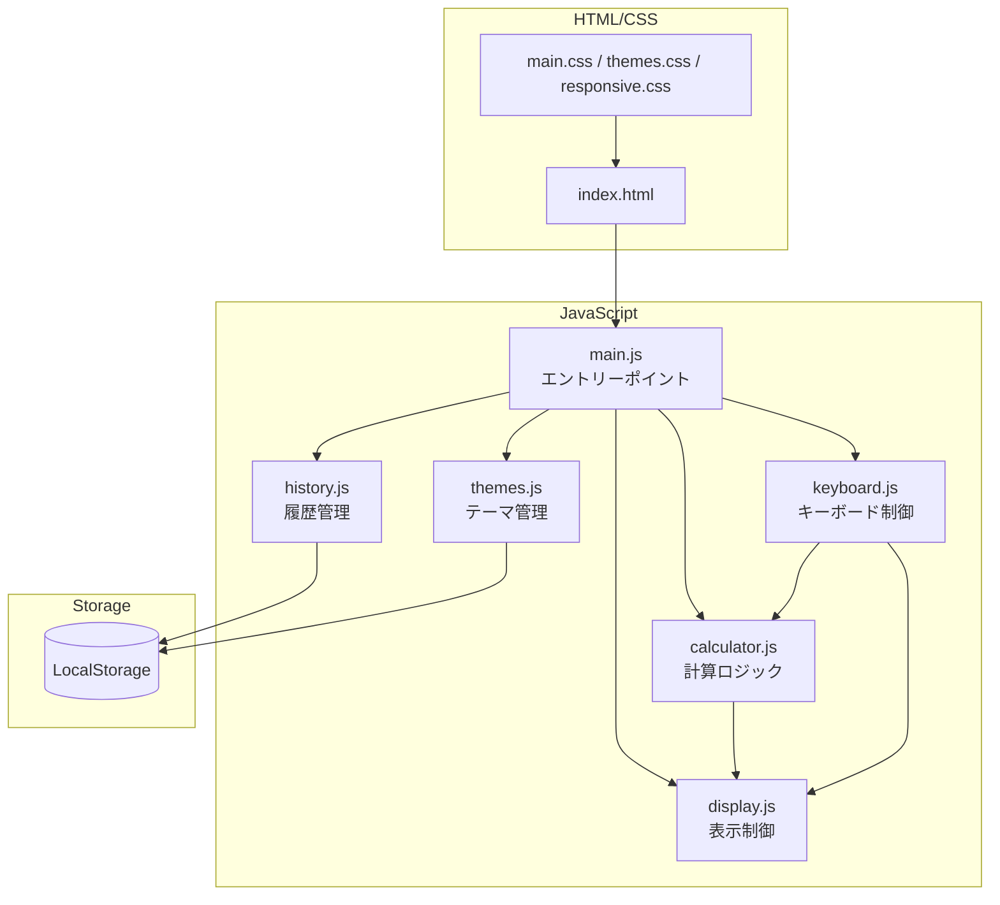

# 詳細設計書

## 文書情報

| 項目 | 内容 |
|------|------|
| プロジェクト名 | Multi-Mode Calculator |
| 文書バージョン | 1.0 |
| 作成日 | 2025-12-11 |
| 最終更新日 | 2025-12-11 |
| 作成者 | Claude Code |

---

## 1. 設計概要

### 1.1 目的

本書は、Multi-Mode Calculatorの内部設計（詳細設計）を記述する。開発者がプログラミング可能なレベルまで設計を詳細化し、実装フェーズへの移行を円滑にする。

### 1.2 対象読者

- 開発者（プログラマー）
- テスター

### 1.3 関連ドキュメント

| ドキュメント | 参照先 |
|--------------|--------|
| 基本設計書 | docs/design/external/00_基本設計書.md |
| 画面設計書 | docs/design/external/03_画面設計書/ |
| 機能要件定義書 | docs/requirements/02_機能要件定義書.md |

---

## 2. アーキテクチャ設計

### 2.1 レイヤー構成

```
┌─────────────────────────────────────────────────────────────────────┐
│                      プレゼンテーション層                            │
│  ┌─────────────────────────────────────────────────────────────┐   │
│  │  index.html + CSS                                           │   │
│  │  - DOM構造                                                  │   │
│  │  - スタイル定義                                             │   │
│  └─────────────────────────────────────────────────────────────┘   │
├─────────────────────────────────────────────────────────────────────┤
│                        コントローラー層                              │
│  ┌─────────────────────────────────────────────────────────────┐   │
│  │  main.js                                                    │   │
│  │  - イベントバインディング                                    │   │
│  │  - モジュール初期化                                         │   │
│  │  - 状態管理                                                 │   │
│  └─────────────────────────────────────────────────────────────┘   │
├─────────────────────────────────────────────────────────────────────┤
│                         ビジネス層                                   │
│  ┌───────────────┐ ┌───────────────┐ ┌─────────────────────────┐   │
│  │ calculator.js │ │  display.js   │ │      themes.js          │   │
│  │ - 計算ロジック │ │ - 表示更新   │ │  - テーマ切り替え       │   │
│  └───────────────┘ └───────────────┘ └─────────────────────────┘   │
│  ┌───────────────┐ ┌───────────────┐                               │
│  │  history.js   │ │  keyboard.js  │                               │
│  │ - 履歴管理    │ │ - キー入力   │                               │
│  └───────────────┘ └───────────────┘                               │
├─────────────────────────────────────────────────────────────────────┤
│                        データアクセス層                              │
│  ┌─────────────────────────────────────────────────────────────┐   │
│  │  storage.js（history.js, themes.js内に包含）                 │   │
│  │  - LocalStorage操作                                         │   │
│  └─────────────────────────────────────────────────────────────┘   │
└─────────────────────────────────────────────────────────────────────┘
```

### 2.2 モジュール依存関係図



---

## 3. モジュール一覧

### 3.1 JavaScriptモジュール

| モジュールID | ファイル名 | 責務 | 対応画面 |
|-------------|-----------|------|----------|
| MOD-001 | main.js | アプリケーション初期化、イベントバインド | 全画面 |
| MOD-002 | calculator.js | 計算ロジック（全モード） | SCR-001〜003 |
| MOD-003 | display.js | ディスプレイ更新、フォーマット | SCR-001〜003 |
| MOD-004 | history.js | 計算履歴のCRUD | SCR-004 |
| MOD-005 | themes.js | テーマ切り替え、モード切り替え | SCR-005 |
| MOD-006 | keyboard.js | キーボードイベント処理 | 全画面 |

### 3.2 CSSファイル

| ファイル名 | 責務 |
|-----------|------|
| main.css | 基本レイアウト、コンポーネントスタイル |
| themes.css | テーマ変数定義（10テーマ×2モード） |
| responsive.css | ブレークポイント別スタイル |

---

## 4. トレーサビリティマトリクス

### 4.1 外部設計 → 内部設計

| 画面ID | 機能 | モジュール | 主要関数/メソッド |
|--------|------|-----------|------------------|
| SCR-001 | 標準電卓 | calculator.js | calculate(), inputNumber() |
| SCR-002 | 関数電卓 | calculator.js | scientificOperation() |
| SCR-003 | プログラマ電卓 | calculator.js | convertBase(), bitwiseOperation() |
| SCR-004 | 履歴パネル | history.js | addHistory(), getHistory() |
| SCR-005 | テーマ設定 | themes.js | setTheme(), setMode() |
| SCR-006 | ASCII変換 | calculator.js | hexToAscii(), asciiToHex() |
| 全画面 | キーボード | keyboard.js | handleKeydown() |
| 全画面 | 表示更新 | display.js | updateDisplay() |

---

## 5. 関連ドキュメント一覧

| ドキュメント | ファイルパス |
|--------------|-------------|
| モジュール設計 | 01_モジュール設計/ |
| シーケンス図 | 02_シーケンス図/ |
| データ設計書 | 03_データ設計書.md |
| 共通処理設計書 | 04_共通処理設計書.md |

---

## 6. 命名規則

### 6.1 JavaScript

| 対象 | 規則 | 例 |
|------|------|-----|
| 変数 | camelCase | `currentValue`, `isNegative` |
| 定数 | UPPER_SNAKE_CASE | `MAX_DIGITS`, `DEFAULT_THEME` |
| 関数 | camelCase（動詞で開始） | `calculate()`, `updateDisplay()` |
| クラス | PascalCase | `Calculator`, `HistoryManager` |
| プライベート | アンダースコア接頭辞 | `_internalValue` |
| イベントハンドラ | handleXxx | `handleClick`, `handleKeydown` |

### 6.2 CSS

| 対象 | 規則 | 例 |
|------|------|-----|
| クラス | BEM (Block__Element--Modifier) | `.calculator__display--active` |
| CSS変数 | --kebab-case | `--color-bg-primary` |
| ID | kebab-case | `#main-display` |

### 6.3 ファイル

| 対象 | 規則 | 例 |
|------|------|-----|
| JavaScript | camelCase.js | `calculator.js` |
| CSS | kebab-case.css | `main-styles.css` |
| HTML | kebab-case.html | `index.html` |

---

## 7. エラーハンドリング方針

### 7.1 エラー種別

| 種別 | 対処 | 例 |
|------|------|-----|
| 計算エラー | "Error"表示、状態リセット | ゼロ除算、範囲外 |
| 入力エラー | 入力を無視 | 桁数超過、無効文字 |
| ストレージエラー | コンソールログ、デフォルト値使用 | LocalStorage読み書き失敗 |

### 7.2 例外処理パターン

```javascript
// 計算処理の例外処理
function safeCalculate(expression) {
  try {
    const result = calculate(expression);
    if (!isFinite(result) || isNaN(result)) {
      return { success: false, error: 'Error' };
    }
    return { success: true, value: result };
  } catch (e) {
    console.error('Calculation error:', e);
    return { success: false, error: 'Error' };
  }
}
```

---

## 8. パフォーマンス考慮事項

| 項目 | 対策 |
|------|------|
| イベント処理 | イベントデリゲーション使用 |
| DOM更新 | 必要な要素のみ更新 |
| LocalStorage | 変更時のみ書き込み |
| 計算 | eval()不使用、独自パーサー実装 |
| テーマ切替 | CSS変数による即時反映 |

---

## 変更履歴

| 日付 | バージョン | 変更内容 | 変更者 |
|------|------------|----------|--------|
| 2025-12-11 | 1.0 | 初版作成 | Claude Code |
