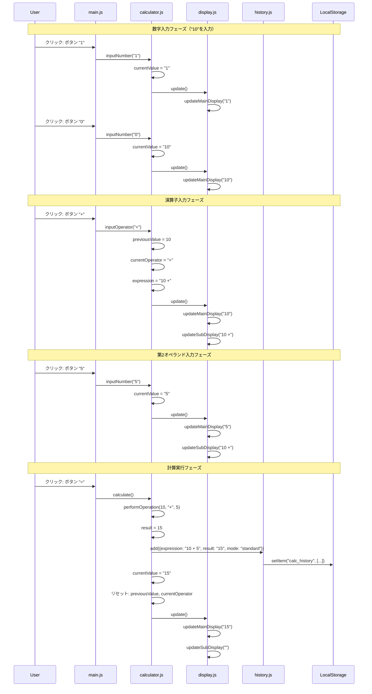
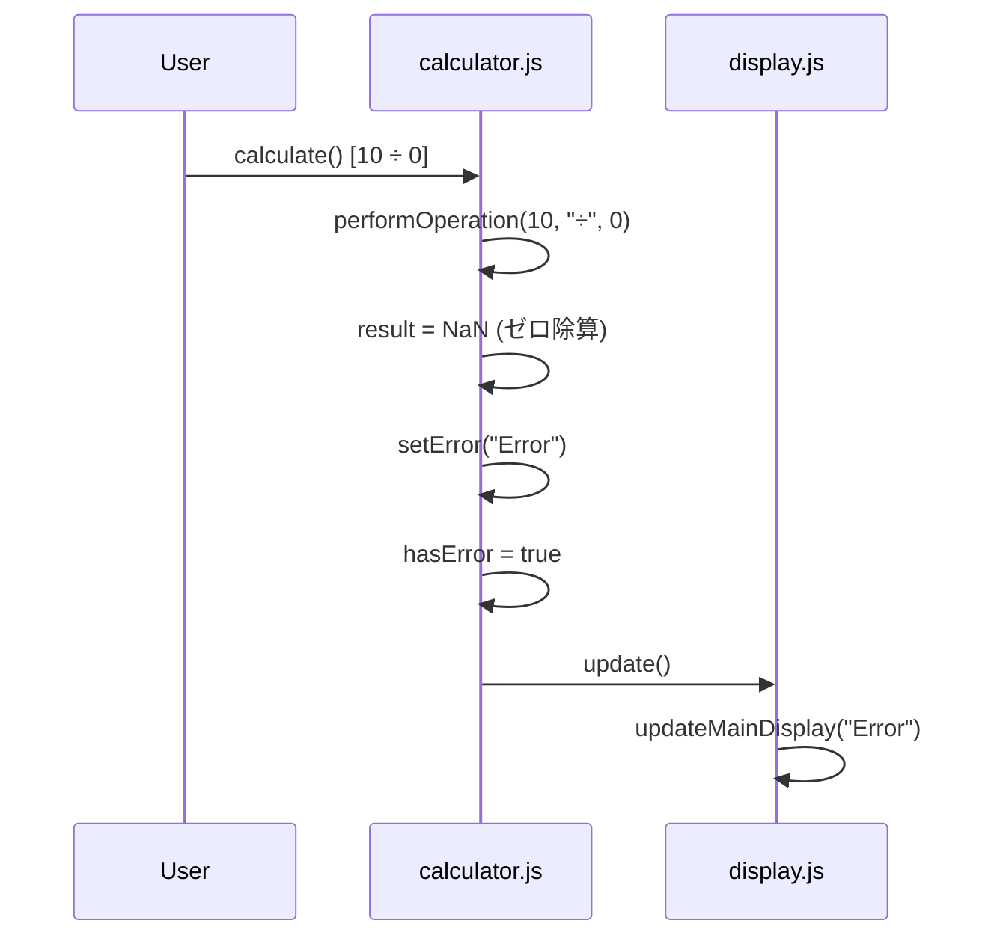
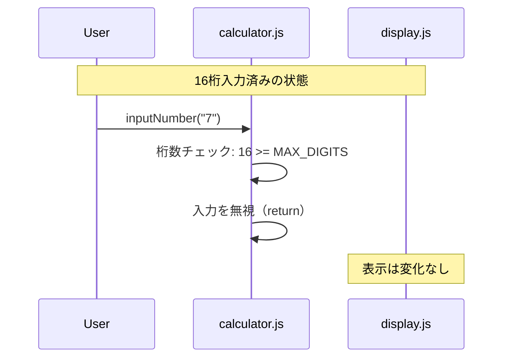

# SEQ-001 基本計算処理シーケンス図

## 文書情報

| 項目 | 内容 |
|------|------|
| シーケンスID | SEQ-001 |
| 処理名 | 基本計算処理（四則演算） |
| 対応画面 | SCR-001（標準電卓） |
| 作成日 | 2025-12-11 |

---

## 1. 概要

ユーザーが「10 + 5 =」のような基本的な四則演算を行う際の処理フローを示す。

---

## 2. シーケンス図

---

## 3. 処理ステップ詳細

### 3.1 数字入力

| ステップ | 処理内容 | 状態変化 |
|---------|---------|---------|
| 1 | ユーザーがボタン"1"をクリック | - |
| 2 | イベントデリゲーションでmain.jsが検知 | - |
| 3 | calculator.inputNumber("1")を呼び出し | currentValue: "0" → "1" |
| 4 | display.update()で表示更新 | 表示: "1" |
| 5 | ユーザーがボタン"0"をクリック | - |
| 6 | calculator.inputNumber("0")を呼び出し | currentValue: "1" → "10" |
| 7 | display.update()で表示更新 | 表示: "10" |

### 3.2 演算子入力

| ステップ | 処理内容 | 状態変化 |
|---------|---------|---------|
| 1 | ユーザーがボタン"+"をクリック | - |
| 2 | calculator.inputOperator("+")を呼び出し | previousValue: null → 10 |
| 3 | 現在の値を保存 | currentOperator: null → "+" |
| 4 | 式を構築 | expression: "" → "10 +" |
| 5 | 結果表示フラグを設定 | isResultDisplayed: true |
| 6 | display.update()で表示更新 | サブ表示: "10 +" |

### 3.3 計算実行

| ステップ | 処理内容 | 状態変化 |
|---------|---------|---------|
| 1 | ユーザーがボタン"="をクリック | - |
| 2 | calculator.calculate()を呼び出し | - |
| 3 | performOperation(10, "+", 5)で計算 | result = 15 |
| 4 | 結果の検証（Infinity, NaNチェック） | - |
| 5 | history.add()で履歴に追加 | 履歴に追加 |
| 6 | LocalStorageに保存 | calc_history更新 |
| 7 | 状態をリセット | previousValue: null, currentOperator: null |
| 8 | display.update()で表示更新 | 表示: "15" |

---

## 4. エラーケース

### 4.1 ゼロ除算

### 4.2 桁数超過

---

## 5. 関連シーケンス

| シーケンスID | 処理名 | 関係 |
|-------------|--------|------|
| SEQ-002 | 関数計算処理 | 派生 |
| SEQ-003 | 進数変換処理 | 派生 |
| SEQ-004 | 履歴操作 | 連携 |

---

## 変更履歴

| 日付 | バージョン | 変更内容 | 変更者 |
|------|------------|----------|--------|
| 2025-12-11 | 1.0 | 初版作成 | Claude Code |
