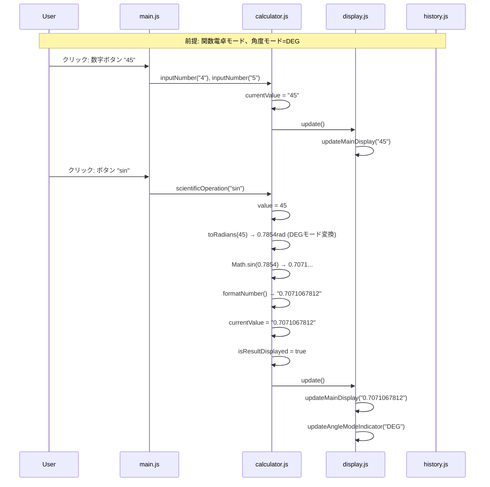
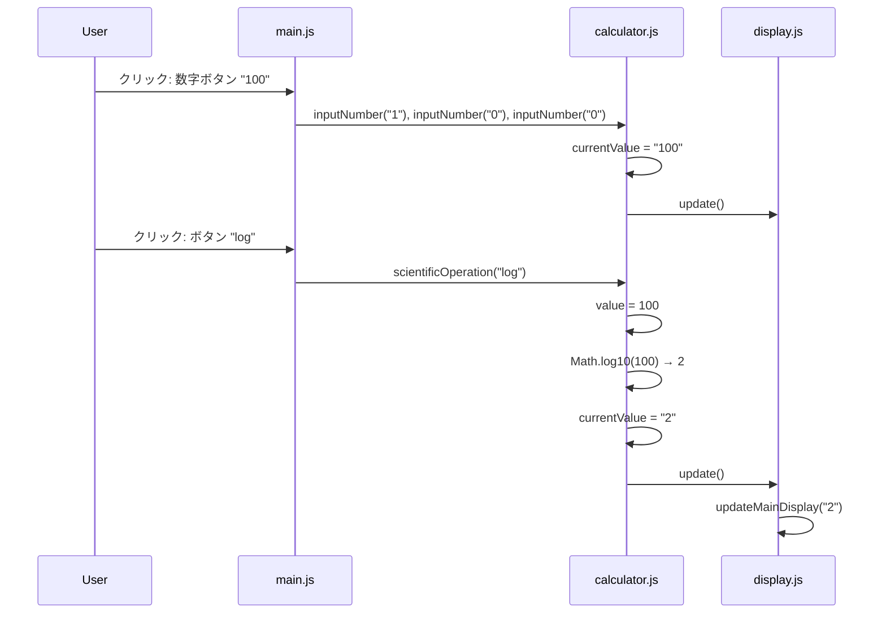
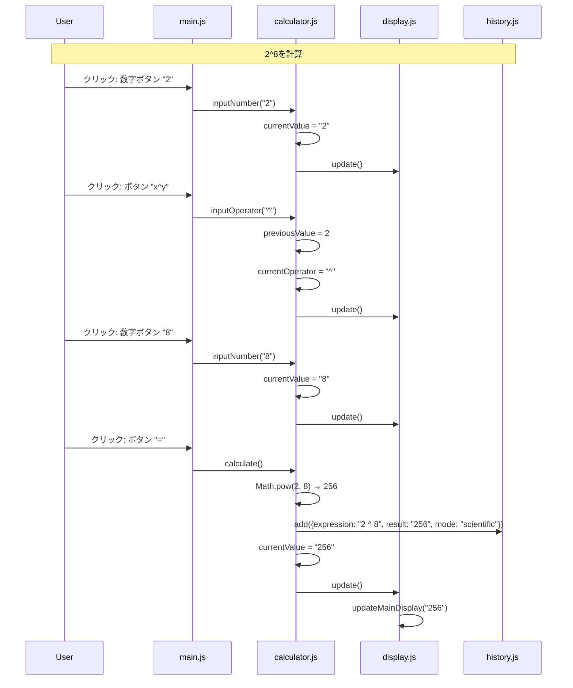
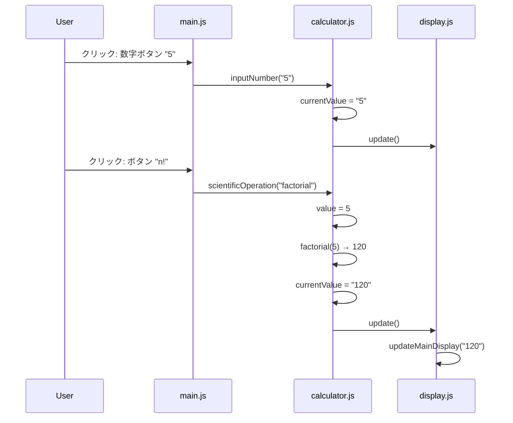
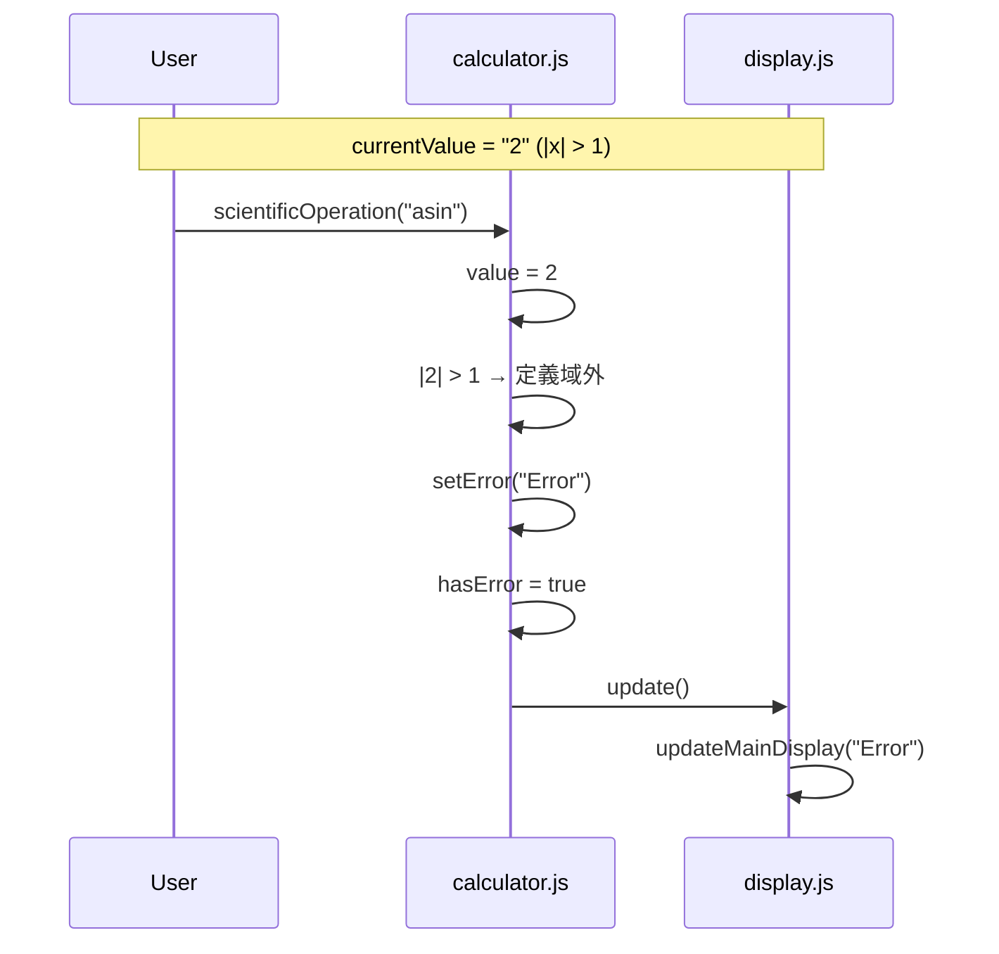
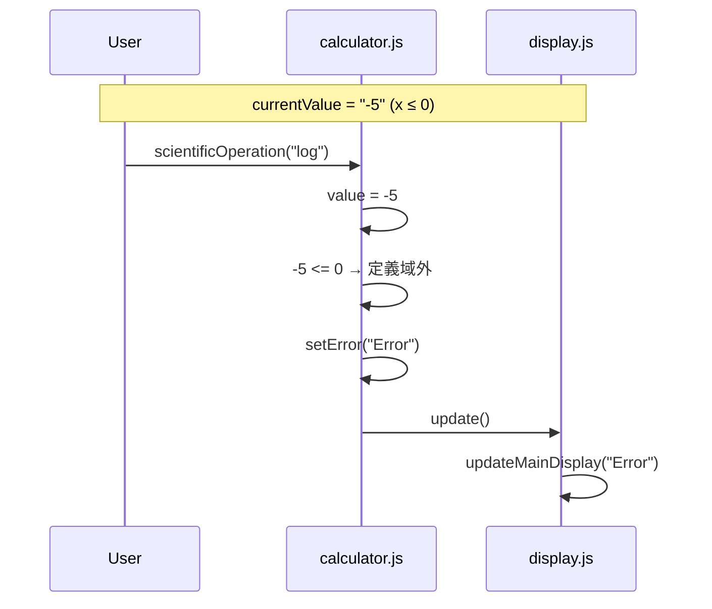
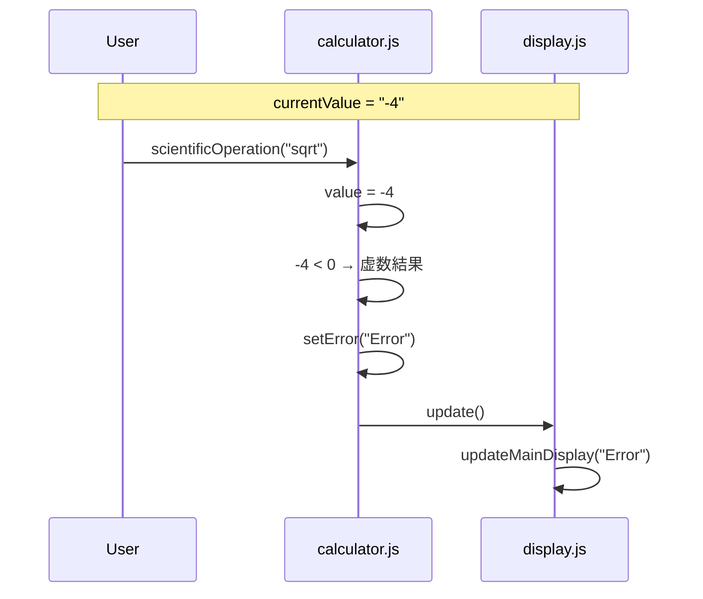
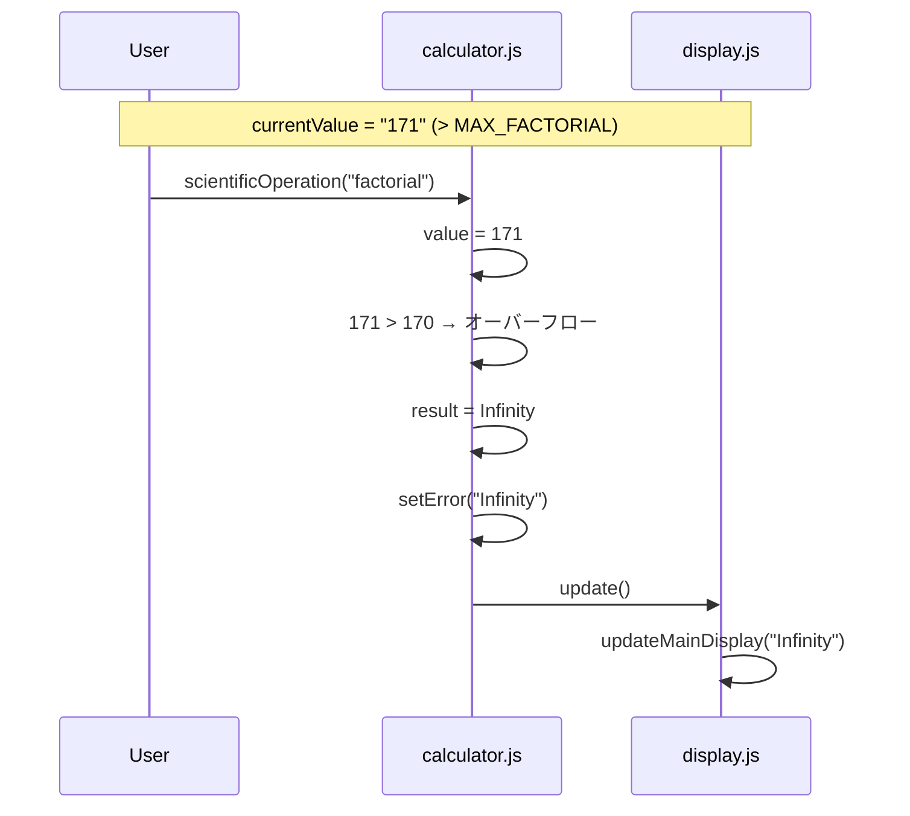
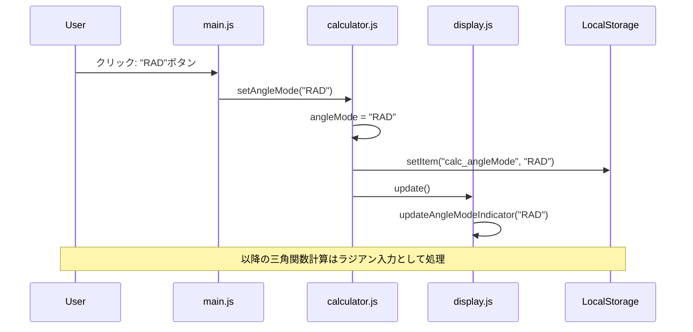

# SEQ-002 関数計算処理シーケンス図

## 文書情報

| 項目 | 内容 |
|------|------|
| シーケンスID | SEQ-002 |
| 処理名 | 関数計算処理（三角関数・対数等） |
| 対応画面 | SCR-002（関数電卓） |
| 作成日 | 2025-12-11 |

---

## 1. 概要

関数電卓モードで三角関数、対数関数、累乗関数などを使用した計算フローを示す。

---

## 2. シーケンス図（sin関数）



---

## 3. シーケンス図（対数関数）



---

## 4. シーケンス図（累乗計算）



---

## 5. シーケンス図（階乗計算）



---

## 6. エラーケース

### 6.1 arcsinの定義域外



### 6.2 対数の定義域外



### 6.3 負の数の平方根



### 6.4 階乗オーバーフロー



---

## 7. 角度モード切替



---

## 8. 処理フロー（関数実行）

```
scientificOperation(func)
    │
    ├─► hasError? ─► return (エラー状態なら何もしない)
    │
    ├─► value = parseFloat(currentValue)
    │
    ├─► switch(func)
    │     ├─► sin/cos/tan: 角度変換 + Math.xxx()
    │     ├─► asin/acos: 定義域チェック + Math.xxx() + 角度変換
    │     ├─► log/ln: 定義域チェック + Math.xxx()
    │     ├─► sqrt: 負数チェック + Math.sqrt()
    │     ├─► factorial: 整数チェック + 上限チェック + 計算
    │     └─► その他...
    │
    ├─► isFinite(result)? ─► No → setError()
    │
    └─► 成功: currentValue = formatNumber(result)
              isResultDisplayed = true
              DisplayManager.update()
```

---

## 変更履歴

| 日付 | バージョン | 変更内容 | 変更者 |
|------|------------|----------|--------|
| 2025-12-11 | 1.0 | 初版作成 | Claude Code |
