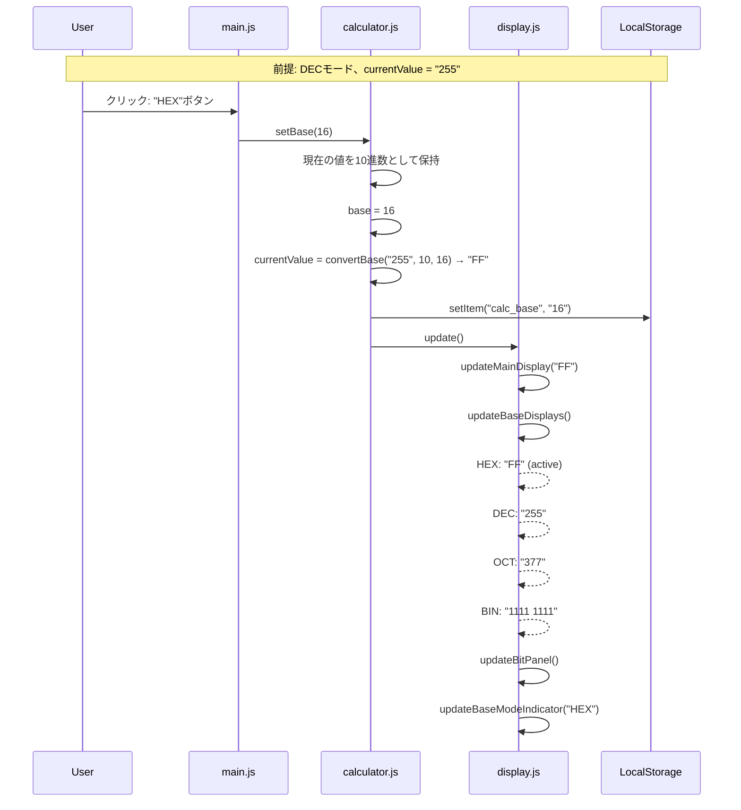
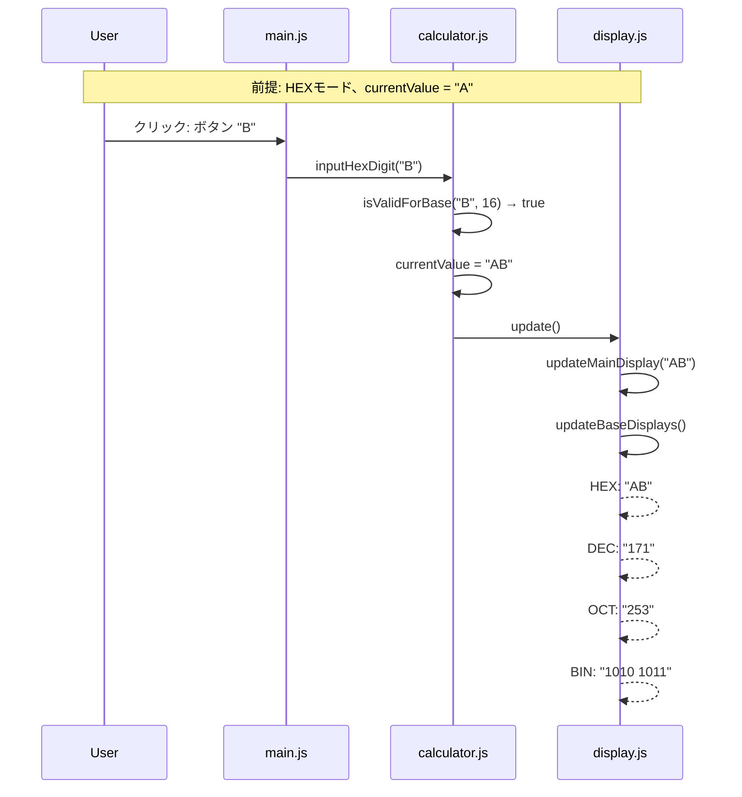
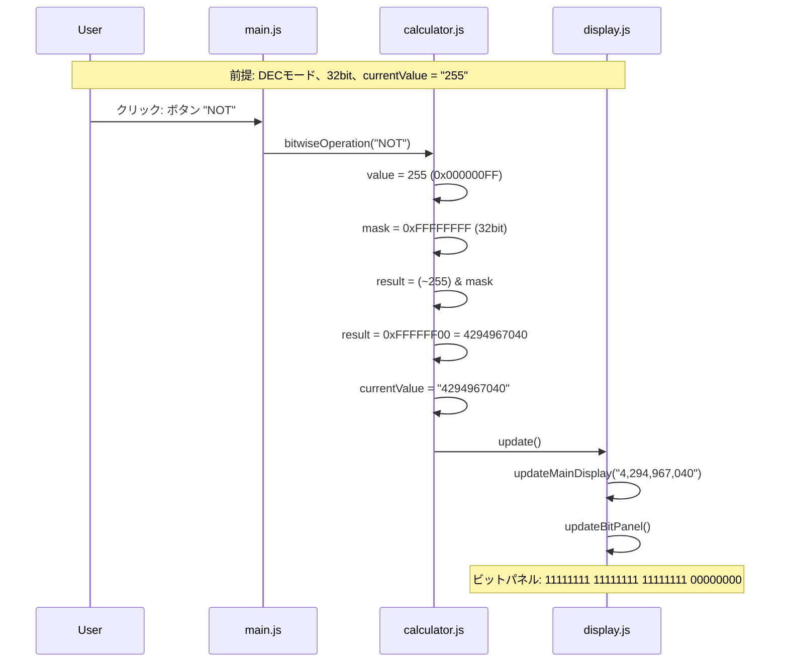
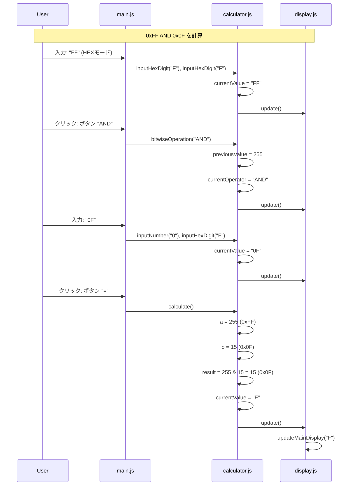
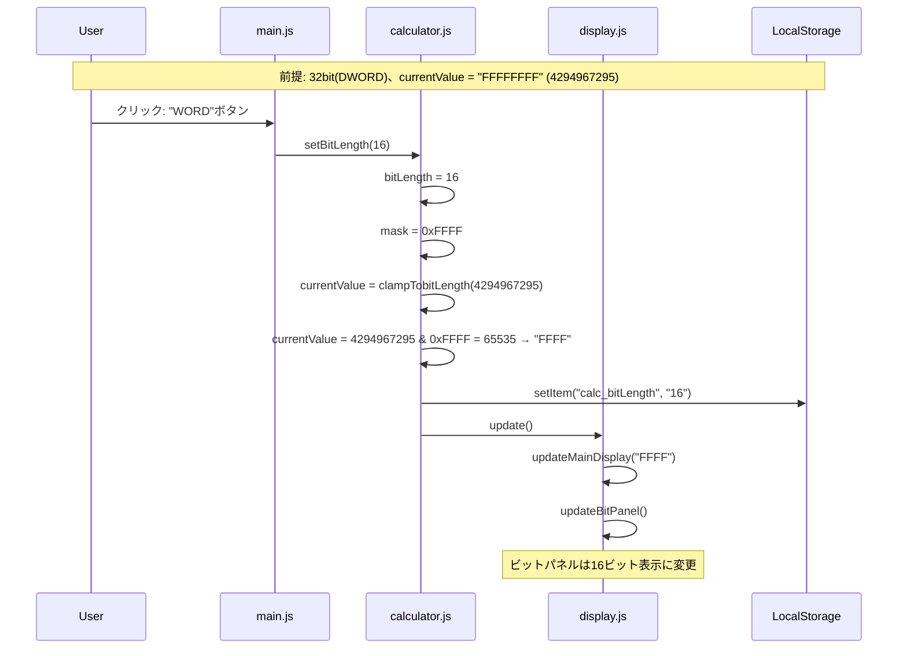
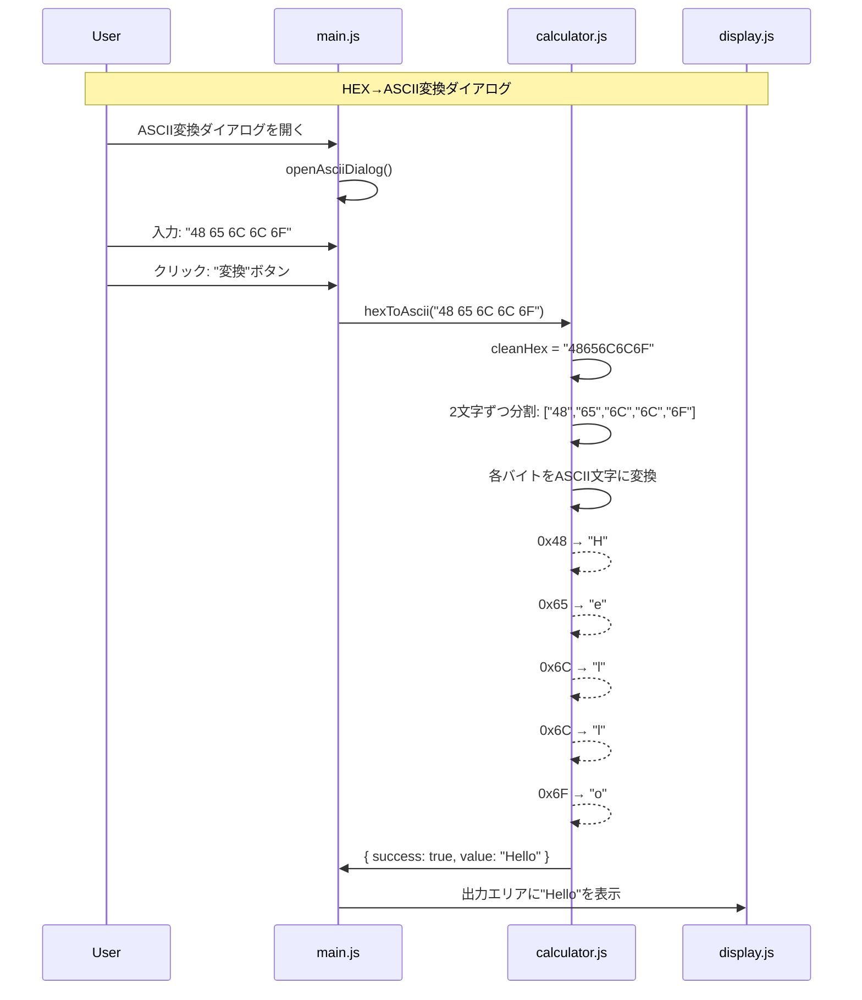
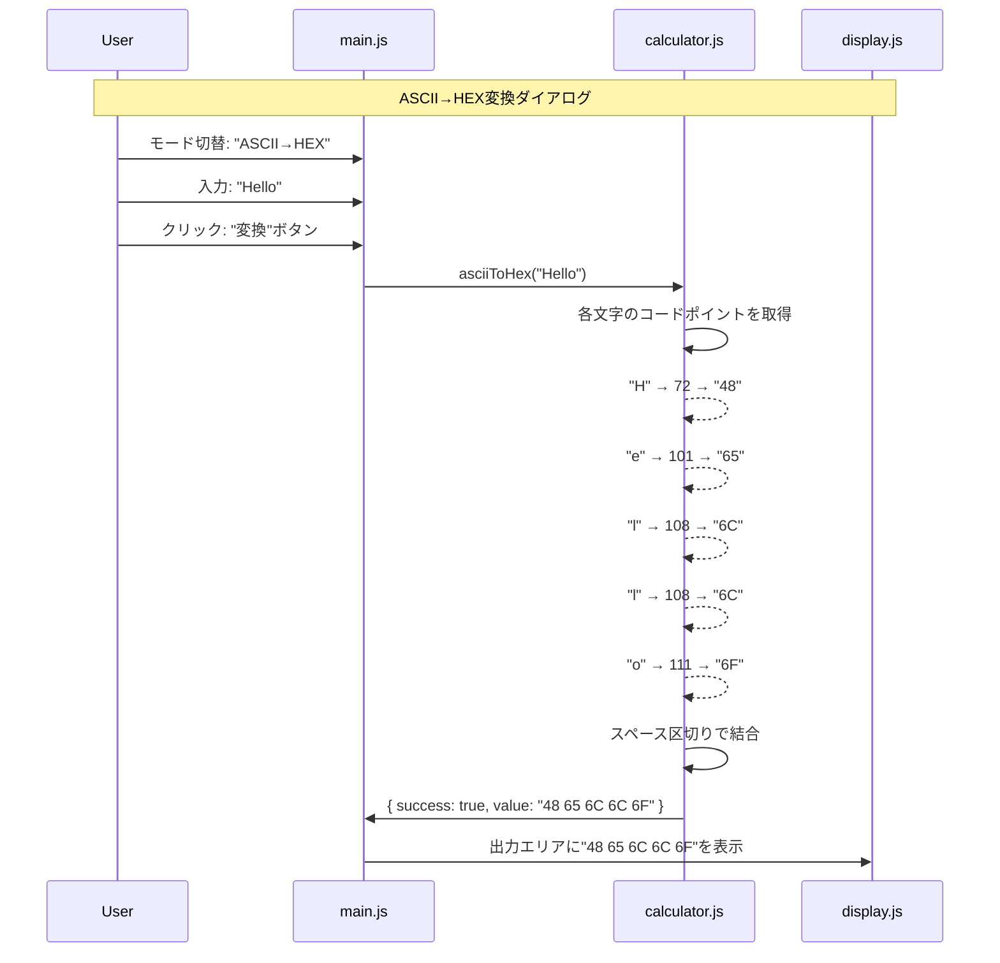
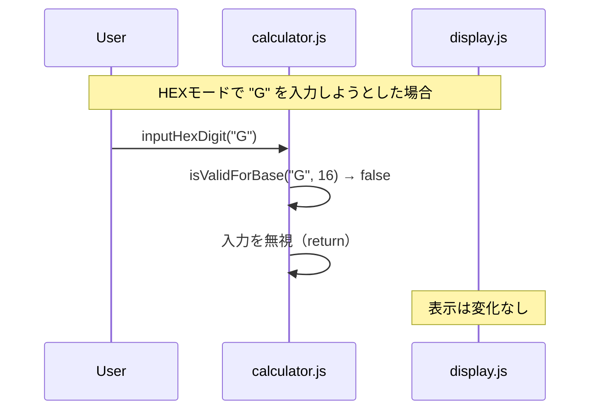
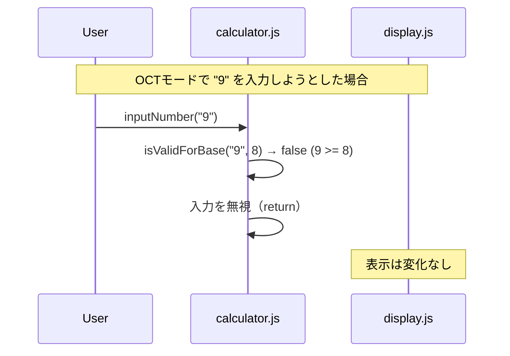
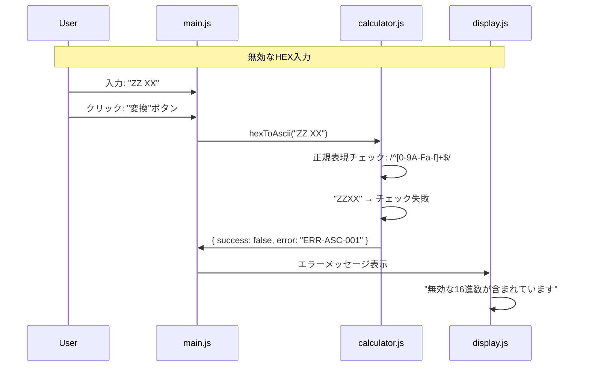

# SEQ-003 進数変換処理シーケンス図

## 文書情報

| 項目 | 内容 |
|------|------|
| シーケンスID | SEQ-003 |
| 処理名 | 進数変換・ビット演算処理 |
| 対応画面 | SCR-003（プログラマ電卓） |
| 作成日 | 2025-12-11 |

---

## 1. 概要

プログラマ電卓モードでの進数切り替え、ビット演算、ASCII変換の処理フローを示す。

---

## 2. シーケンス図（進数切り替え）



---

## 3. シーケンス図（16進数入力）



---

## 4. シーケンス図（ビット演算 - NOT）



---

## 5. シーケンス図（ビット演算 - AND）



---

## 6. シーケンス図（ビット長変更）



---

## 7. シーケンス図（ASCII変換）



---

## 8. シーケンス図（ASCII→HEX変換）



---

## 9. エラーケース

### 9.1 無効な16進数入力



### 9.2 進数モードで無効な数字



### 9.3 ASCII変換エラー



---

## 10. 処理フロー（進数変換）

```
setBase(newBase)
    │
    ├─► 現在の値を10進数に変換
    │     value = parseInt(currentValue, currentBase)
    │
    ├─► base = newBase
    │
    ├─► 新しい進数で文字列化
    │     currentValue = value.toString(newBase).toUpperCase()
    │
    ├─► LocalStorageに保存
    │
    └─► DisplayManager.update()
          ├─► updateMainDisplay()
          ├─► updateBaseDisplays()
          ├─► updateBitPanel()
          └─► updateBaseModeIndicator()
```

---

## 変更履歴

| 日付 | バージョン | 変更内容 | 変更者 |
|------|------------|----------|--------|
| 2025-12-11 | 1.0 | 初版作成 | Claude Code |
