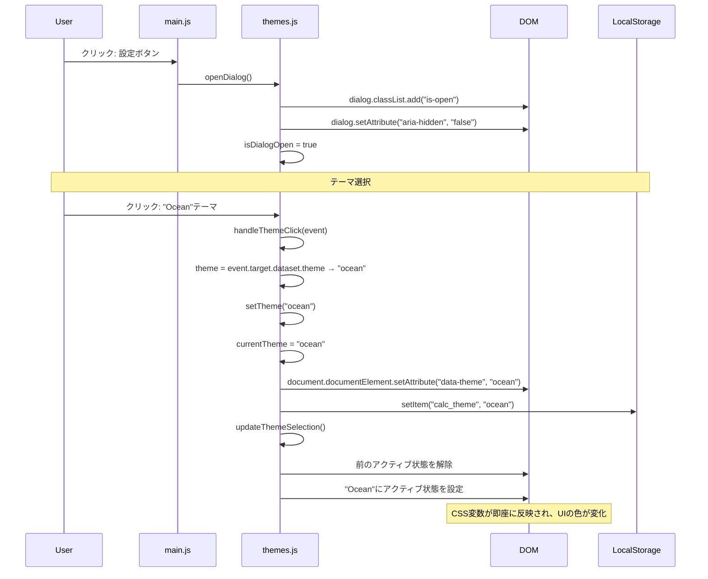
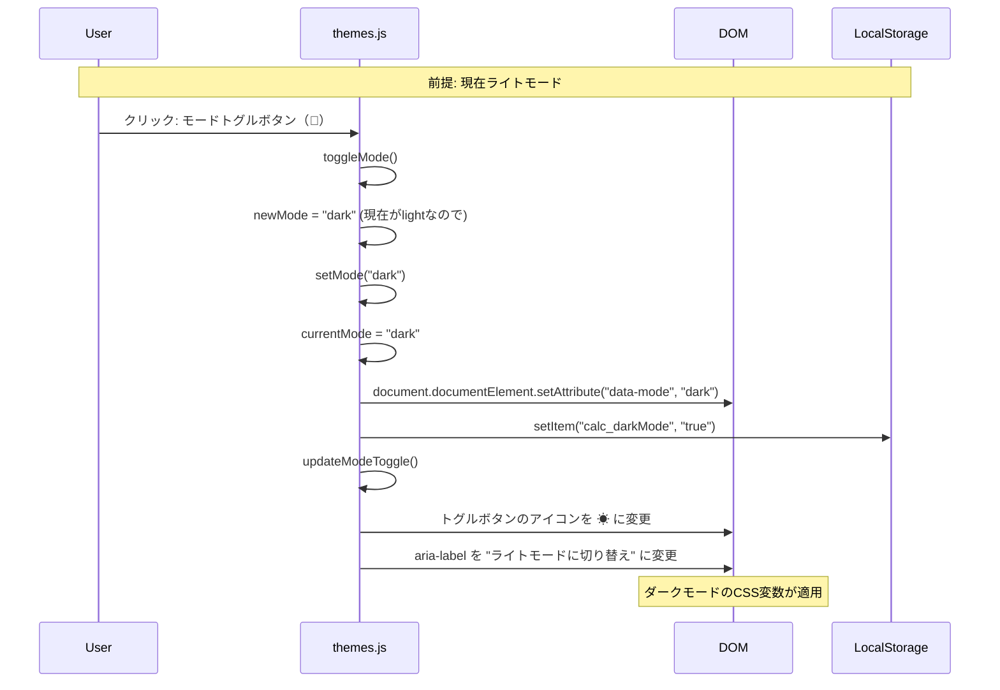
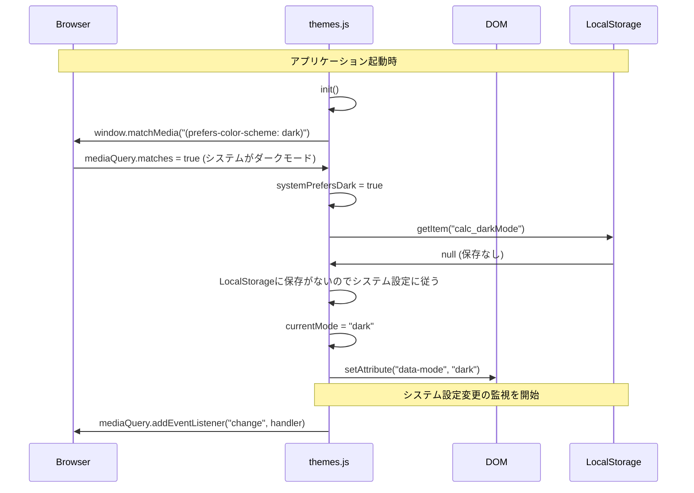
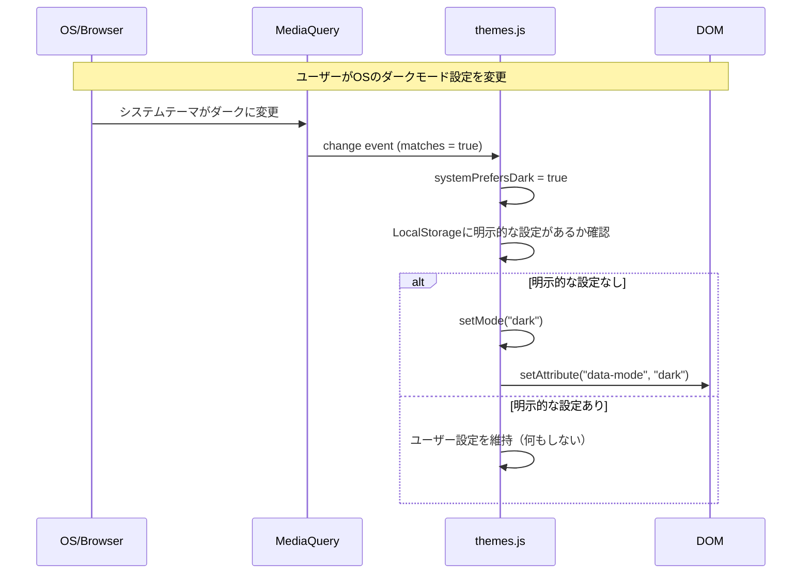
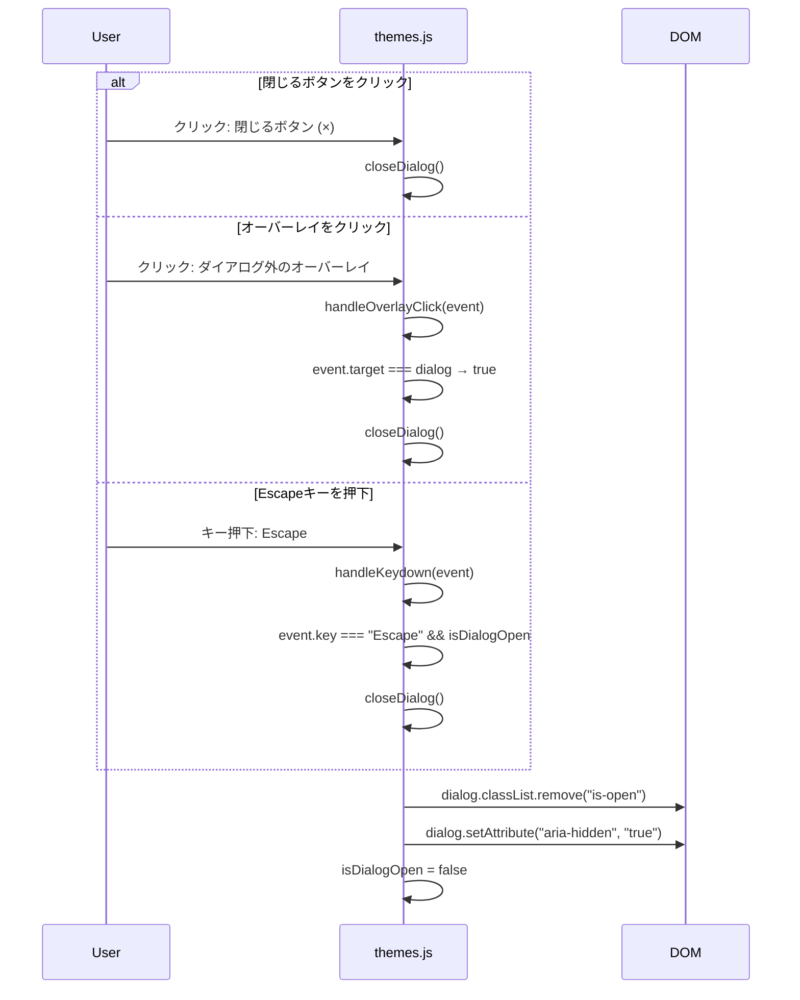
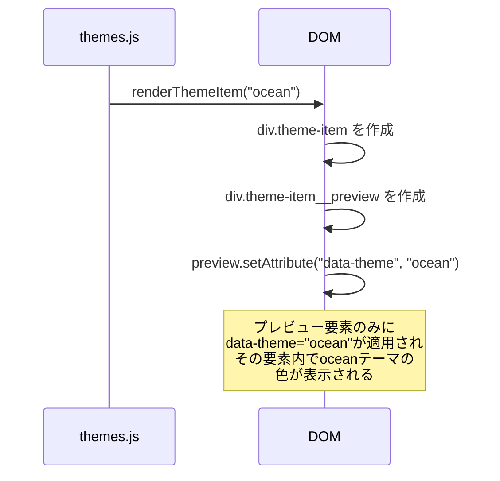

# SEQ-004 テーマ切替処理シーケンス図

## 文書情報

| 項目 | 内容 |
|------|------|
| シーケンスID | SEQ-004 |
| 処理名 | テーマ・ライト/ダークモード切替処理 |
| 対応画面 | SCR-005（テーマ設定ダイアログ） |
| 作成日 | 2025-12-11 |

---

## 1. 概要

テーマ設定ダイアログでのテーマ変更およびライト/ダークモード切替の処理フローを示す。

---

## 2. シーケンス図（テーマ変更）



---

## 3. シーケンス図（ライト/ダークモード切替）



---

## 4. シーケンス図（初期化時のシステム設定検出）



---

## 5. シーケンス図（システム設定変更の自動追従）



---

## 6. シーケンス図（ダイアログを閉じる）



---

## 7. CSS変数の適用フロー

```
setTheme("ocean") + setMode("dark")
    │
    ▼
document.documentElement
    │
    ├─► data-theme="ocean"
    └─► data-mode="dark"
    │
    ▼
CSSセレクタがマッチ
:root[data-theme="ocean"][data-mode="dark"]
    │
    ▼
CSS変数が適用
    --color-bg-primary: #0a192f;
    --color-bg-secondary: #112240;
    --color-text-primary: #e6f1ff;
    --color-accent: #64ffda;
    ...
    │
    ▼
全UI要素が即座に更新（再描画不要）
```

---

## 8. 処理フロー（init）

```
ThemeManager.init()
    │
    ├─► cacheElements()
    │     DOM要素をキャッシュ
    │
    ├─► detectSystemPreference()
    │     ├─► matchMedia("(prefers-color-scheme: dark)")
    │     └─► addEventListener で変更を監視
    │
    ├─► loadFromStorage()
    │     ├─► getItem("calc_theme") → テーマを復元
    │     └─► getItem("calc_darkMode") → モードを復元
    │           └─► 保存なし → システム設定に従う
    │
    ├─► setupEventListeners()
    │     ├─► モードトグルボタン
    │     ├─► 閉じるボタン
    │     ├─► テーマリストクリック
    │     └─► オーバーレイクリック
    │
    ├─► applyTheme()
    │     └─► setAttribute("data-theme", ...)
    │
    ├─► applyMode()
    │     └─► setAttribute("data-mode", ...)
    │
    └─► renderThemeList()
          └─► 各テーマのプレビューカードを描画
```

---

## 9. テーマプレビューの仕組み



CSS側の対応：
```css
.theme-item__preview[data-theme="ocean"] {
  --preview-bg: #1a365d;
  --preview-accent: #4299e1;
  background: var(--preview-bg);
}

.theme-item__preview[data-theme="ocean"]::before {
  background: var(--preview-accent);
}
```

---

## 変更履歴

| 日付 | バージョン | 変更内容 | 変更者 |
|------|------------|----------|--------|
| 2025-12-11 | 1.0 | 初版作成 | Claude Code |
