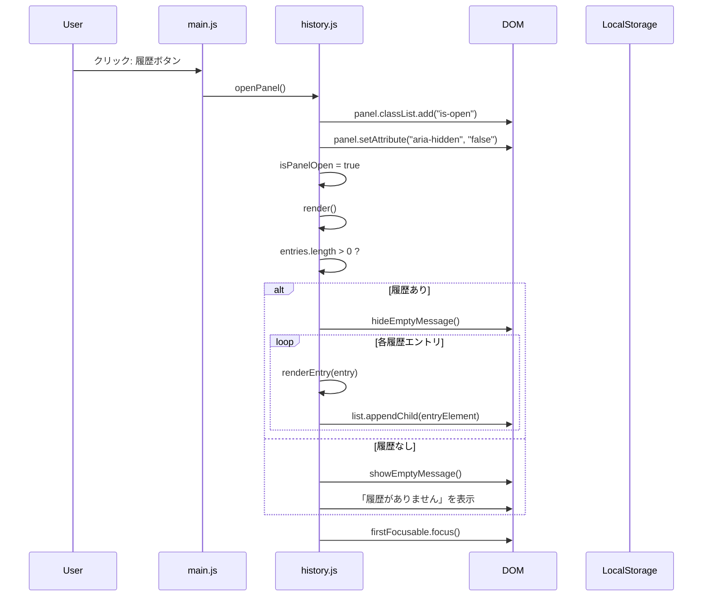
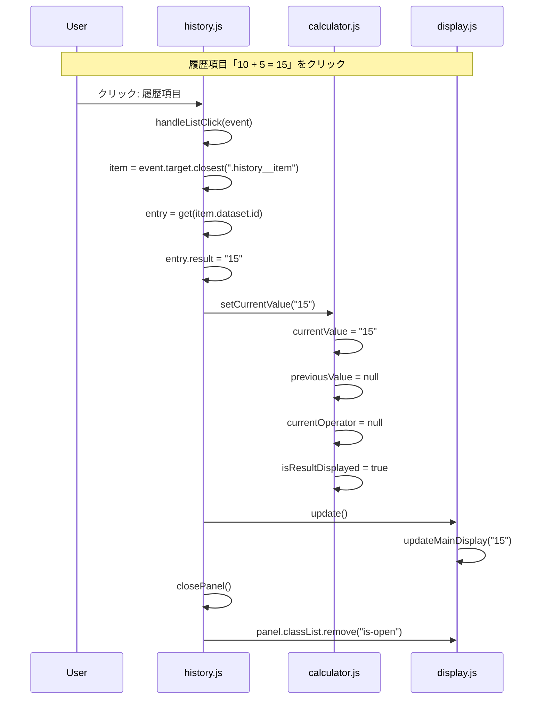
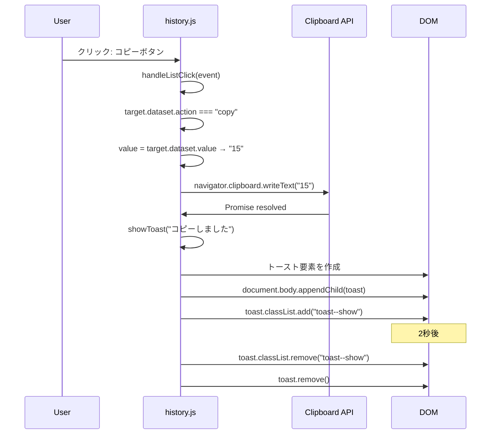
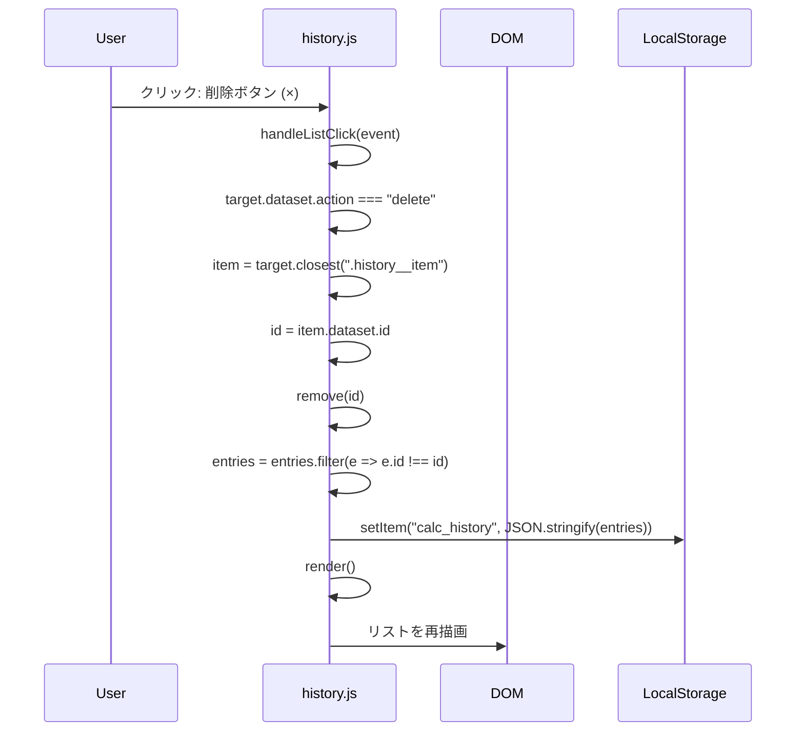
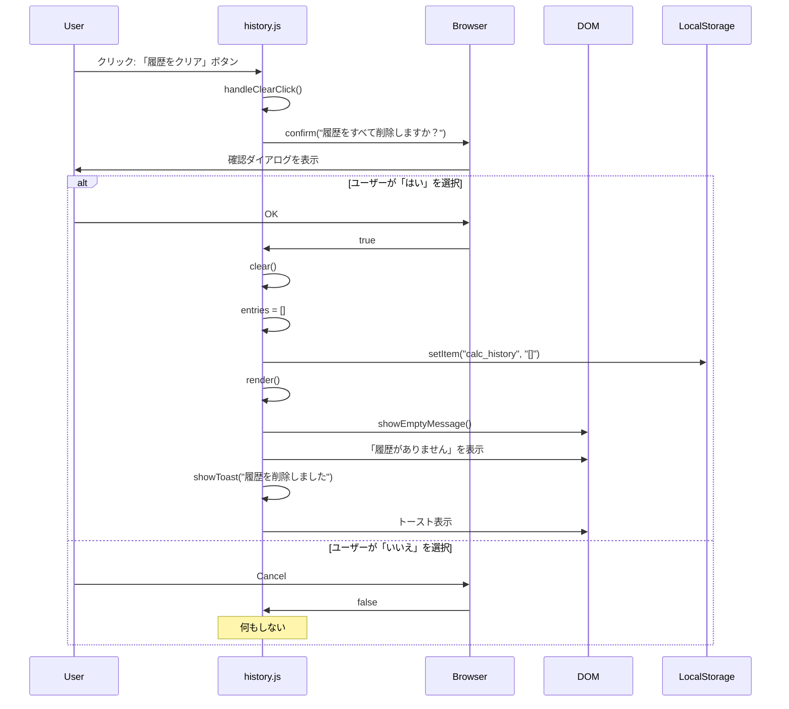
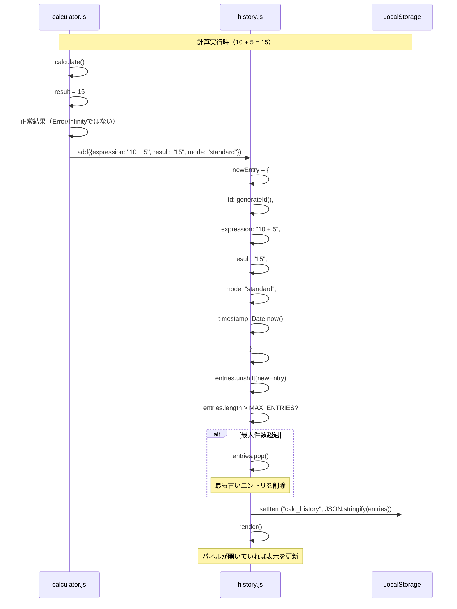
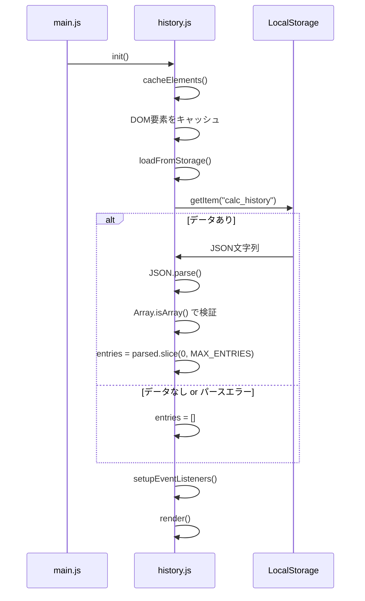
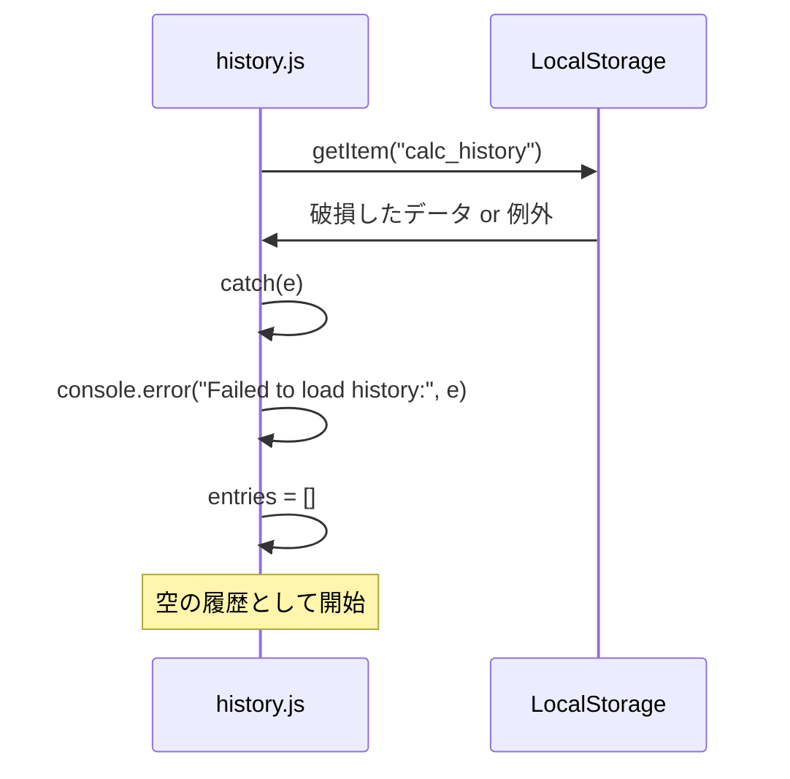
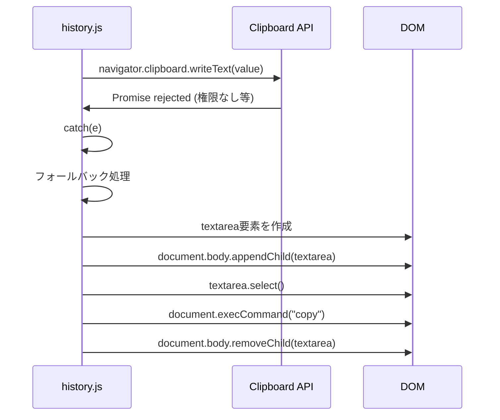

# SEQ-005 履歴操作処理シーケンス図

## 文書情報

| 項目 | 内容 |
|------|------|
| シーケンスID | SEQ-005 |
| 処理名 | 履歴の表示・操作処理 |
| 対応画面 | SCR-004（履歴パネル） |
| 作成日 | 2025-12-11 |

---

## 1. 概要

計算履歴パネルの表示、履歴項目の選択、削除などの操作フローを示す。

---

## 2. シーケンス図（履歴パネルを開く）



---

## 3. シーケンス図（履歴項目をクリック）



---

## 4. シーケンス図（履歴項目をコピー）



---

## 5. シーケンス図（履歴項目を削除）



---

## 6. シーケンス図（全履歴をクリア）



---

## 7. シーケンス図（計算結果の履歴追加）



---

## 8. シーケンス図（起動時の履歴読み込み）



---

## 9. 処理フロー（履歴追加）

```
HistoryManager.add(entry)
    │
    ├─► newEntry = {
    │     id: generateId(),  ← タイムスタンプ + ランダム
    │     expression: entry.expression,
    │     result: entry.result,
    │     mode: entry.mode,
    │     timestamp: Date.now()
    │   }
    │
    ├─► entries.unshift(newEntry)  ← 先頭に追加
    │
    ├─► if (entries.length > MAX_ENTRIES)
    │     └─► entries.pop()  ← 末尾（最古）を削除
    │
    ├─► saveToStorage()
    │     └─► localStorage.setItem(...)
    │
    └─► render()  ← パネルが開いていれば更新
```

---

## 10. 日時表示フォーマット

```
formatTimestamp(timestamp)
    │
    ├─► 今日の場合
    │     └─► "14:30" (時:分のみ)
    │
    ├─► 今年の場合
    │     └─► "12月11日 14:30" (月日 + 時分)
    │
    └─► それ以外
          └─► "2025/12/11" (年月日)
```

---

## 11. エラーハンドリング

### 11.1 LocalStorage読み込みエラー



### 11.2 クリップボードAPIエラー



---

## 変更履歴

| 日付 | バージョン | 変更内容 | 変更者 |
|------|------------|----------|--------|
| 2025-12-11 | 1.0 | 初版作成 | Claude Code |
